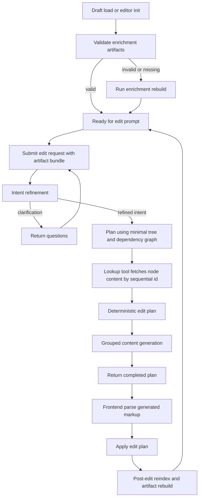

# DraftSpace Edit Pipeline Audit and Refactor Plan

## 1. Audit Summary

The current pipeline is close to usable but is failing due to contract drift across frontend and backend, non-deterministic enrichment lifecycle behavior, and schema mismatches between planning and execution.

Primary breakpoints identified:

1. Identity and heading attribute mismatch
   - Enrichment writes `precedingHeadingId` while editor schema defines `nearestPrecedingHeadingId`.
   - Result: heading linkage is unstable and may be dropped by editor serialization.

2. Legacy `blockId` path still active in editor selection and tree navigation
   - Selection and tree lookup still depend on `blockId` instead of `lexpalId`.
   - Result: selection and node targeting can diverge from edit pipeline identity.

3. Frontend and backend edit operation schema mismatch
   - Planner emits `content` strings while executor expects `replacement` or `nodes` after parse.
   - There is partial compatibility conversion, but contract remains fragile and under-validated.

4. Enrichment lifecycle is flag-driven but not invariant-driven
   - Current checks rely on boolean flags instead of validating artifact integrity.
   - Result: stale or partial enrichment may pass checks and cause later runtime failures.

5. Sequential mapping incomplete for deterministic planning context
   - One-way map is passed, but bidirectional mapping is not persisted as first-class artifact.
   - Result: alias resolution ambiguity and unstable diagnostics.

6. Memo and dependency generation rules are not aligned with required node classes
   - Prompt currently asks for memo on every node and dependencies for paragraph-only nodes.
   - Required behavior is memo for non-heading block nodes with `lexpalId`, and dependencies for basic-unit block nodes.

7. Post-edit recomputation is incomplete
   - After applying edits, only part of enrichment is updated in the current flow.
   - Result: minimal tree, dependencies, memos, heading linkage, and mappings can drift.

8. Server-side validation gaps
   - Request payloads are not fully schema-validated before use.
   - Intent refinement JSON parse path is brittle.
   - Node indexing does not fail fast on duplicate IDs.

## 2. Non-Negotiable Invariants

These invariants will be enforced in code and tests:

1. `lexpalId` is permanent node identity.
2. Existing `lexpalId` values are never regenerated or reassigned.
3. Only newly inserted nodes receive new `lexpalId` values.
4. Inline nodes must never carry `lexpalId` or `precedingHeadingId`.
5. Every block pipeline node must carry `lexpalId` and `precedingHeadingId`.
6. All artifacts are derived from the same document snapshot version.
7. Planning and execution schemas are deterministic and strictly validated.
8. Edit submission never proceeds if enrichment artifacts fail integrity checks.

## 3. Target Deterministic Architecture

### 3.1 Canonical artifacts in draft store

Persist and version as one atomic artifact bundle:

- `currentDoc`
- `minimalIndexTree`
- `dependencyGraph`
- `sequentialToLexpalMap`
- `lexpalToSequentialMap`
- `nodeMetadata`

Additional metadata:

- `artifactVersion`
- `derivedFromDocHash`
- `generatedAt`

### 3.2 Wire contract

Introduce strict request and response schema contracts for:

- edit request payload
- clarification response
- refined intent response
- final edit plan response

All boundary data is validated before use. Invalid payloads return structured 4xx responses.

### 3.3 Two-phase backend processing

1. intent refinement and clarification loop
2. deterministic planning and generation

Planner receives only index and dependency context initially and uses lookup tool for node content retrieval.

### 3.4 Frontend execution contract

1. parse generated markup exactly once per step
2. attach parsed node payload to operation
3. run strict operation validation
4. execute plan
5. run full post-edit reindex pipeline

## 4. End-to-End State Flow

## 5. Refactor Workstreams

### Workstream A: Shared contracts and guards

1. Define canonical operation schema and remove legacy ambiguity.
2. Validate all API request and response payloads.
3. Enforce strict JSON parsing and fail-fast error surfaces.

### Workstream B: Enrichment correctness

1. Refactor enrichment walk to block-only ID assignment.
2. Normalize heading linkage to `precedingHeadingId` everywhere.
3. Migrate legacy attribute names during load and replace.
4. Add invariant validator that verifies artifacts, not just boolean flags.

### Workstream C: Memo and dependency compliance

1. Restrict memo targets to valid node classes.
2. Compute dependencies only for basic-unit block nodes.
3. Validate dependency endpoints exist and are legal targets.

### Workstream D: Sequential IDs and lookup infrastructure

1. Persist both mapping directions in store.
2. Maintain session-stable mapping unless node set changes.
3. Build strict server lookup map with duplicate-id detection.
4. Deterministically resolve sequential alias to `lexpalId`.

### Workstream E: Backend planner and generation stability

1. Harden clarification loop with bounded rounds and schema validation.
2. Keep planner blind to full doc content initially.
3. Ensure tool lookup returns exact node content or typed errors.
4. Group generation by generationGroup and validate attachment completeness.

### Workstream F: Frontend plan execution and reindex

1. Remove legacy fallback ambiguity where possible.
2. Validate operation shape per step before apply.
3. Preserve target ID on replace and moved node identity on move.
4. Recompute full artifact bundle post-edit, not partial updates.

### Workstream G: Editor and tree identity alignment

1. Replace remaining `blockId` usages with `lexpalId` path.
2. Keep selection and tree navigation consistent with pipeline identity.

### Workstream H: Test harness and regression suite

1. Add deterministic unit tests for enrichment invariants.
2. Add contract tests for request and response schema.
3. Add pipeline integration tests for:
   - clarification loop
   - plan generation with tool lookups
   - parser failure handling
   - execution rollback behavior on invalid step
   - post-edit artifact rebuild

## 6. Implementation Checklist for Code Mode

- [ ] Introduce canonical draft edit contract types and runtime validators
- [ ] Unify `precedingHeadingId` naming across schema and enrichment
- [ ] Add migration shim from legacy heading and block attributes
- [ ] Replace legacy `blockId` usages in editor selection and tree utilities
- [ ] Refactor enrichment pipeline to atomic artifact bundle generation
- [ ] Add artifact integrity validator and use it at load init replace submit gates
- [ ] Refactor analysis prompt and post-processor for memo and dependency rules
- [ ] Persist bidirectional sequential mappings in store and wire payload
- [ ] Harden backend controller payload validation and error typing
- [ ] Harden intent refinement JSON parsing and bounded clarification rounds
- [ ] Refactor planner tool loop validation and strict node lookup behavior
- [ ] Refactor generation grouping validation and required output checks
- [ ] Tighten frontend step parsing and operation validation
- [ ] Trigger full post-edit reindex and artifact recomputation after apply
- [ ] Add unit and integration tests for deterministic behavior and failure paths

## 7. Acceptance Criteria

Pipeline is considered stabilized only when all criteria are met:

1. Edit request on loaded draft never executes with missing enrichment artifacts.
2. No runtime exceptions for valid edit prompts across supported node types.
3. Existing `lexpalId` values remain unchanged after replace and move operations.
4. Newly inserted nodes receive valid new IDs and are included in all derived artifacts.
5. Clarification and refined intent responses always parse and validate.
6. Planner tool lookups resolve sequential aliases deterministically.
7. Post-edit artifact bundle is internally consistent and versioned.
8. End-to-end tests pass for successful and failure-mode scenarios.

